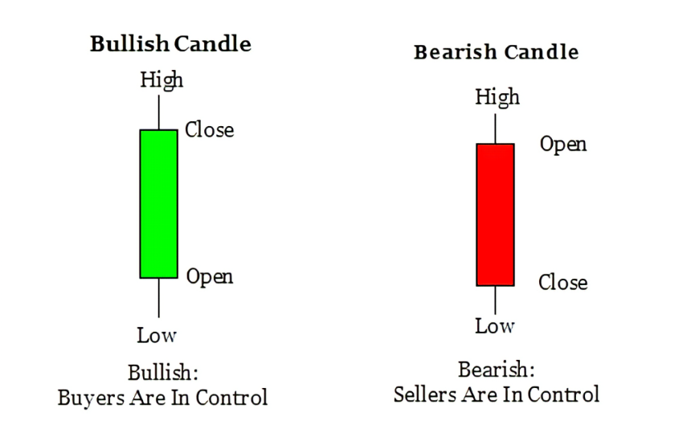
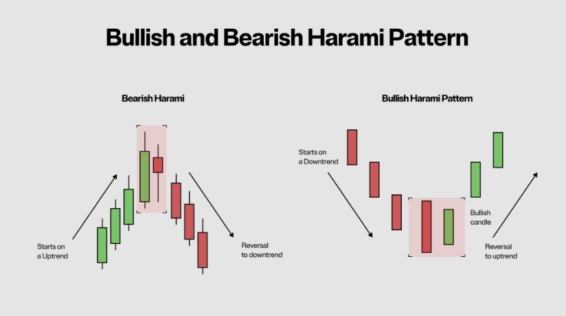

[comment]: # "This is the standard layout for the project, but you can clean this and use your own template"

# Predicting Forex Currency Exchange Rate using Machine Learning

  
   

#### Team

- E/18/375, Vindula K.P.A., [e18375@eng.pdn.ac.lk](mailto:e18375@eng.pdn.ac.lk)
- E/18/330, Sewwandi H.R., [e18330@eng.pdn.ac.lk](mailto:e18330@eng.pdn.ac.lk)
- E/18/323, Seekkubadu H.D., [e18323@eng.pdn.ac.lk](mailto:e18323@eng.pdn.ac.lk)

#### Supervisors

- Dr. Suneth Namal Karunarathna, [namal@eng.pdn.ac.lk](mailto:namal@eng.pdn.ac.lk)

#### Table of content

1. [Abstract](#abstract)
2. [Introduction](#introduction)
3. [Related works](#related-works)
4. [Methodology](#methodology)
5. [Experiment Setup and Implementation](#experiment-setup-and-implementation)
6. [Results and Analysis](#results-and-analysis)
7. [Conclusion](#conclusion)
8. [Publications](#publications)
9. [Links](#links)

---

<!-- 
DELETE THIS SAMPLE before publishing to GitHub Pages !!!
This is a sample image, to show how to add images to your page. To learn more options, please refer [this](https://projects.ce.pdn.ac.lk/docs/faq/how-to-add-an-image/)
 
-->

## Abstract

This research explores the potential of machine learning techniques in predicting forex currency exchange rates by leveraging a comprehensive set of technical and fundamental economic indicators. Recognizing the complexity and volatility of the foreign exchange market, our study seeks to develop a robust predictive model by integrating advanced machine learning algorithms. We aim to navigate the complexity of the foreign exchange market by identifying the most influential features through meticulous feature selection and designing novel architectures, refining our model’s performance through parameter optimization. The study anticipates contributing to a more accurate understanding of the factors driving forex market dynamics, yielding a reliable predictive model with potential applications for traders, investors, corporations, and policymakers.

## Introduction 

#### Forex Market

  
   
  <em>Figure 1.1:  OHLC prices in Forex market </em>

  
   
  <em>Figure 1.2:  Uptrend and Downtrend in Forex market </em>

The forex market, also known as the foreign exchange market, is a global platform where participants engage in the buying and selling of currencies. It stands as the largest and most liquid financial market globally, with its daily trading volume exceeding $6 trillion. What distinguishes forex trading is its accessibility and constant activity, operating 24 hours a day, five days a week across different time zones. One of the key features of the forex market is its high liquidity, which means that traders can easily buy and sell currencies without significantly affecting their prices. This liquidity is driven by the participation of various entities, including central banks, financial institutions, corporations, governments, and individual traders. The forex market offers a wide range of currency pairs for trading, including major pairs like EUR/USD, GBP/USD, and USD/JPY, as well as minor and exotic pairs. These pairs create diverse market structures based on the combinations of currencies involved. For instance, while major pairs involve the world's strongest currencies, minor and exotic pairs may involve currencies from emerging or smaller economies.

Traders analyze the forex market using various techniques, including fundamental analysis, technical analysis, and sentiment analysis. Fundamental analysis involves evaluating economic indicators, central bank policies, geopolitical events, and other factors that influence currency values. Technical analysis, on the other hand, relies on chart patterns, trend lines, and technical indicators to forecast price movements. Sentiment analysis gauges market sentiment and investor mood through factors such as news sentiment, social media activity, and trader positioning. OHLC (Open, High, Low, Close) prices are widely used in forex analysis, providing comprehensive information about price movements within specific time frames. These price data help traders identify trends, reversals, support and resistance levels, and other key trading opportunities.

In recent years, advancements in technology, particularly in the field of machine learning, have enabled traders to develop sophisticated trading algorithms and models. These algorithms analyze vast amounts of historical and real-time data to identify patterns and trends, automate trading decisions, and manage risks more effectively. Overall, the forex market's dynamic nature, high liquidity, and accessibility make it a popular choice for traders seeking opportunities to profit from fluctuations in currency values around the world.

## Related works

In our exploration of Forex currency exchange rate prediction, we have delved into various methodologies employed by scientists and experts across different domains. Recognizing the significance of predicting currency exchange rates, we've examined key models utilized in this endeavor. Our investigation has focused on bordering each area to uncover insights and refine our approach.

Key Models Explored:

- Convolutional Neural Networks (CNN)
- Recurrent Neural Networks (RNN)
- Long Short-Term Memory (LSTM)

####  Convolutional Neural Networks (CNN)

  
   
  <em>Figure 2.1:  CNN Architecture </em>

A convolutional neural network (CNN) is a type of deep learning neural network that is specifically designed for image recognition and classification tasks. CNNs are inspired by the structure of the human visual cortex, and they have been shown to be highly effective in a wide range of applications, including image classification, object detection, and facial recognition. The key characteristic of a CNN is its use of convolutional layers, which are made up of small filters (or kernels) that are applied to the input image. These filters extract features from the image, such as edges, lines, and corners. The output of the convolutional layer is then passed through a pooling layer, which reduces the dimensionality of the data and helps to make the network more robust to small variations in the input image. After the convolutional and pooling layers, the CNN typically has one or more fully connected layers, which are similar to the layers found in traditional neural networks. The fully connected layers are used to classify the input image into one or more categories.

For an example, one of the research carried out under the CNN to make the prediction is mentioned here. In the pursuit of accurate financial time series forecasting, researchers Alexiei Dingli and Karl Sant Fournier xie propose a novel deep learning approach leveraging Convolutional Neural Networks (CNNs). Their study, titled "Financial Time Series Forecasting – A Deep Learning Approach," introduces a CNN-based model developed using TensorFlow, fine-tuned for optimal performance. The model incorporates two convolutional and pooling layers, employing same padding with a stride of 1 and ReLU activation functions for feature extraction. By harnessing the TensorFlow library's Argmax function, the researchers calculate accuracy while fine-tuning network parameters such as depth, learning rate, receptive area size, and feature count for each convolutional layer. Notably, their model achieves a commendable accuracy of 65% in forecasting the next month's price direction and 60% for predicting the next week's price direction, highlighting the effectiveness of deep learning methodologies in financial forecasting.

####  Recurrent Neural Networks (RNN)

  
   
  <em>Figure 2.2:  RNN Architecture </em>

RNNs are designed for sequential data processing. It includes feedback loops and feed the output signal of a neuron back into the neuron. This way, information from previous time steps is preserved as hidden state (ℎ terms). The objective of training a neural network is to minimize the value of a loss function, which represents the cumulative difference between the model’s outputs and the true labels. 

In a study titled "Using Recurrent Neural Networks To Forecasting of Forex," researchers focused on training Recurrent Neural Networks (RNNs) to predict exchange rates between the American Dollar and four other major currencies: Japanese Yen, Swiss Franc, British Pound, and Euro. Employing the Elman-Jordan neural network method, they discovered that the most effective network configuration incorporated two crucial indicators: moving average and returns as inputs. To enhance accuracy, they replaced the moving average with exponential moving average, which better approximates time series data and encapsulates information from longer time periods. Their findings suggest that RNNs can predict the sign of increments in Forex rates with a high probability of approximately 80%, demonstrating practical viability for Forex forecasting applications.

In Recurrent Neural Networks (RNNs) often use activation functions such as the hyperbolic tangent (tanh) or the logistic sigmoid (σ). The derivative of both lies in the interval [0, 1]. Because of that two significant problems often arise during training,  gradient exploding and gradient vanishing. 

  - Gradient Exploding:
    

    Gradient exploding occurs when the gradients of the loss function become too large during backpropagation. This phenomenon leads to unstable training and makes it challenging to update the network parameters       effectively. As a result, the model's performance deteriorates, and the training process becomes unreliable.
    

  - Gradient Vanishing:
    

    Gradient vanishing, on the other hand, happens when the gradients of the loss function become extremely small during backpropagation. In such cases, the gradients diminish as they propagate through time steps,     causing earlier time steps to have little to no influence on the parameter updates. Consequently, the RNN struggles to capture long-term dependencies in the data, limiting its ability to learn meaningful           patterns over extended sequences.
    

    

Both gradient exploding and gradient vanishing can hinder the training of RNNs and degrade their performance in tasks requiring the modeling of sequential data. These issues are particularly problematic in scenarios where the data exhibits long-term dependencies or temporal patterns that extend over many time steps.

To address these challenges, various techniques have been proposed, including gradient clipping to prevent exploding gradients and architectural modifications such as Long Short-Term Memory (LSTM) and Gated Recurrent Unit (GRU) cells, which are designed to mitigate the vanishing gradient problem by allowing the network to selectively retain and update information over time.

####  Long Short-Term Memory (LSTM)

  
   
  <em>Figure 2.3:  LSTM Architecture </em>

Long Short-Term Memory (LSTM) networks are a powerful type of recurrent neural network (RNN) designed to overcome limitations in handling long-term dependencies present in traditional RNNs. LSTMs utilize "gates" to control the flow of information, allowing them to selectively remember and forget information relevant to the task at hand. This enables them to effectively process sequential data like speech, text, and time series data, making them valuable in applications like machine translation, speech recognition, and handwriting recognition.

In the investigation titled "Using Long Short-Term Memory To Forecasting of Forex," researchers explored various LSTM approaches to predict Forex trends. Their study encompassed three primary methodologies: the Macroeconomic LSTM model, the Technical LSTM model, and the Hybrid LSTM Model. Among these, the Hybrid LSTM Model emerged as the most promising, showcasing superior predictive capabilities for Forex data. This comprehensive analysis sheds light on the effectiveness of LSTM-based techniques in forecasting Forex trends, with the hybrid approach demonstrating notable success in capturing and leveraging both macroeconomic and technical factors for enhanced prediction accuracy.

## Methodology

#### Proposed Work

In our exploration of forecasting Forex currency exchange rates, we've observed various approaches employed by researchers, among which the LSTM model has consistently demonstrated superior performance. Building upon this promising foundation, our research endeavors to enhance the LSTM model's predictive capabilities.

We aim to address several key insights: 

  1. Can major trends in price fluctuations of a currency pair be predicted in advance?
  2. Can the start point of these fluctuations be predicted with acceptable accuracy?
  3. Can the end point of these fluctuations also be forecasted with acceptable accuracy?

These questions lie at the heart of our investigation, driving us to refine and innovate within the realm of Forex prediction, with the ultimate goal of providing more reliable insights for traders and investors.

## Experiment Setup and Implementation

## Results and Analysis

## Conclusion

## Publications
[//]: # "Note: Uncomment each once you uploaded the files to the repository"

<!-- 1. [Semester 7 report](./) -->
<!-- 2. [Semester 7 slides](./) -->
<!-- 3. [Semester 8 report](./) -->
<!-- 4. [Semester 8 slides](./) -->
<!-- 5. Author 1, Author 2 and Author 3 "Research paper title" (2021). [PDF](./). -->

## Links

[//]: # ( NOTE: EDIT THIS LINKS WITH YOUR REPO DETAILS )

- [Project Repository](https://github.com/cepdnaclk/e18-4yp-Predicting-Forex-Currency-Exchange-Rate-using-Machine-Learning)
- [Project Page](https://cepdnaclk.github.io/e18-4yp-Predicting-Forex-Currency-Exchange-Rate-using-Machine-Learning)
- [Department of Computer Engineering](http://www.ce.pdn.ac.lk/)
- [University of Peradeniya](https://eng.pdn.ac.lk/)

[//]: # "Please refer this to learn more about Markdown syntax"
[//]: # "https://github.com/adam-p/markdown-here/wiki/Markdown-Cheatsheet"
